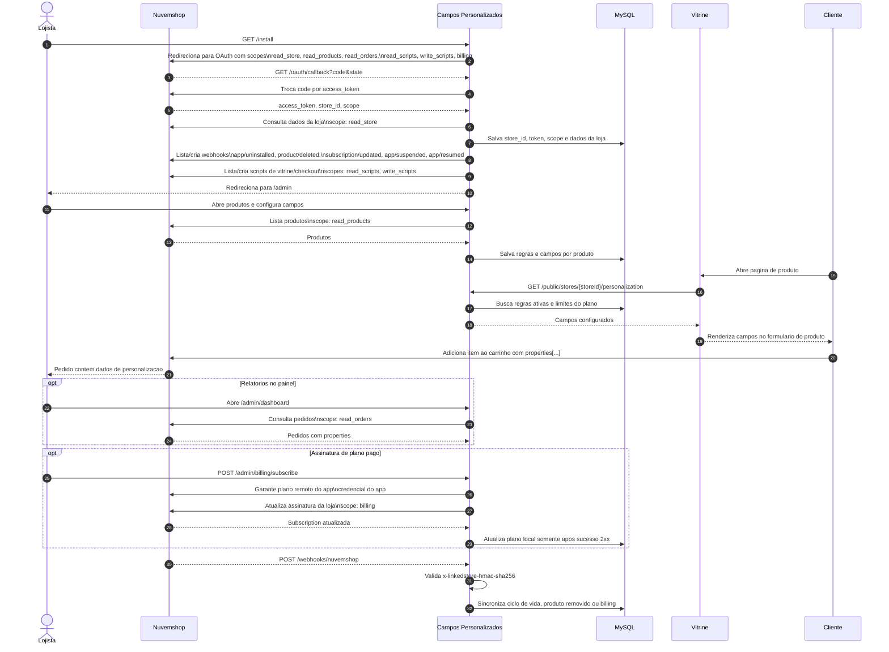

# Diagrama de sequencia e escopos utilizados

Este artefato atende ao requisito: "Diagrama de sequencia e como ele deve representar os escopos utilizados".

O diagrama deve deixar explicito quais escopos sao usados em cada etapa. A autorizacao acontece uma vez no OAuth, mas a homologacao precisa enxergar por que cada permissao e necessaria.

## Diagrama

## Escopos OAuth

| Escopo | Onde aparece no fluxo | Motivo tecnico | Cuidado de homologacao |
| --- | --- | --- | --- |
| `read_store` | Pos-OAuth e billing | Ler nome, pais e moeda da loja para identificar a conta e aplicar preco correto por mercado. | Usar somente dados minimos da loja; nao expor token ou dados internos em logs. |
| `read_products` | `/admin/products`, `/admin/onboarding` | Listar produtos para o lojista escolher onde aplicar campos personalizados. | Nao alterar catalogo com esse escopo; apenas leitura. |
| `read_orders` | `/admin/dashboard` | Ler pedidos para mostrar relatorios de personalizacoes ja recebidas via `properties[...]`. | A leitura deve ser limitada ao painel/logica de relatorios; evitar armazenar dados de comprador desnecessariamente. |
| `read_scripts` | Instalacao/reinstalacao | Verificar se os scripts do app ja existem antes de criar duplicatas. | Idempotencia na instalacao e reconexao. |
| `write_scripts` | Instalacao/reinstalacao e desinstalacao | Registrar/remover o JavaScript que injeta os campos na vitrine/checkout. | Criar apenas scripts do proprio app e remover apenas scripts reconhecidos pelo app. |
| `billing` | `/admin/billing/subscribe` e sincronizacao | Criar/atualizar assinatura recorrente dos planos pagos do app. | Usar apenas para planos pagos aceitos; manter plano local inalterado se a API de billing falhar. |

## Como representar os escopos no diagrama

- Mostrar todos os escopos na etapa de redirecionamento OAuth.
- Repetir o escopo especifico ao lado da chamada em que ele e usado.
- Agrupar chamadas opcionais em blocos `opt`, como relatorios (`read_orders`) e assinatura (`billing`).
- Diferenciar chamadas feitas com token da loja das chamadas feitas com credencial do app.
- Indicar que webhooks sao validados antes de alterar estado local.
